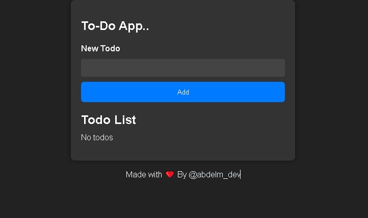
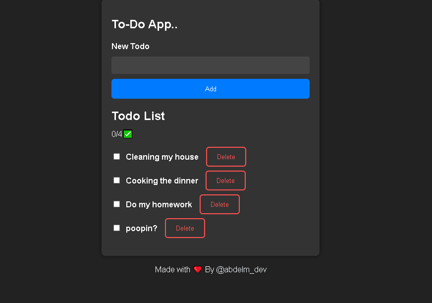

# TodoList Simple Application

This is a simple TodoList web application built using React. It allows you to create, manage, and track your tasks conveniently.

<table>
  <tr>
    <td align="center"></td>
    <td align="center"></td>
  </tr>
</table>

## Features

- Add new tasks to your to-do list.
- Mark tasks as completed or uncompleted.
- Delete tasks from your list.
- Real-time progress tracking.

## Getting Started

To get started with this project, follow these steps:

1. Clone the repository to your local machine:

```bash
git clone https://github.com/ZPIDERr/todo-list.git
```

2. Change your working directory to the project folder:

```bash
cd TodoList-React
```

3. Install the necessary dependencies:

```bash
npm install
```

4. Start the development server:

```bash
npm start
```

5. Open your web browser and visit [http://localhost:3000](http://localhost:3000) to see the TodoList application in action.

## Usage

- To add a new task, enter a task description in the input field and click the "Add" button.
- To mark a task as completed or uncompleted, click the checkbox next to the task.
- To delete a task, click the "Delete" button next to the task.
- Track your progress in real-time at the bottom of the list.

## Credits

- This project was created with ❤️ by [@abdelm_dev](https://twitter.com/abdelm_dev).
